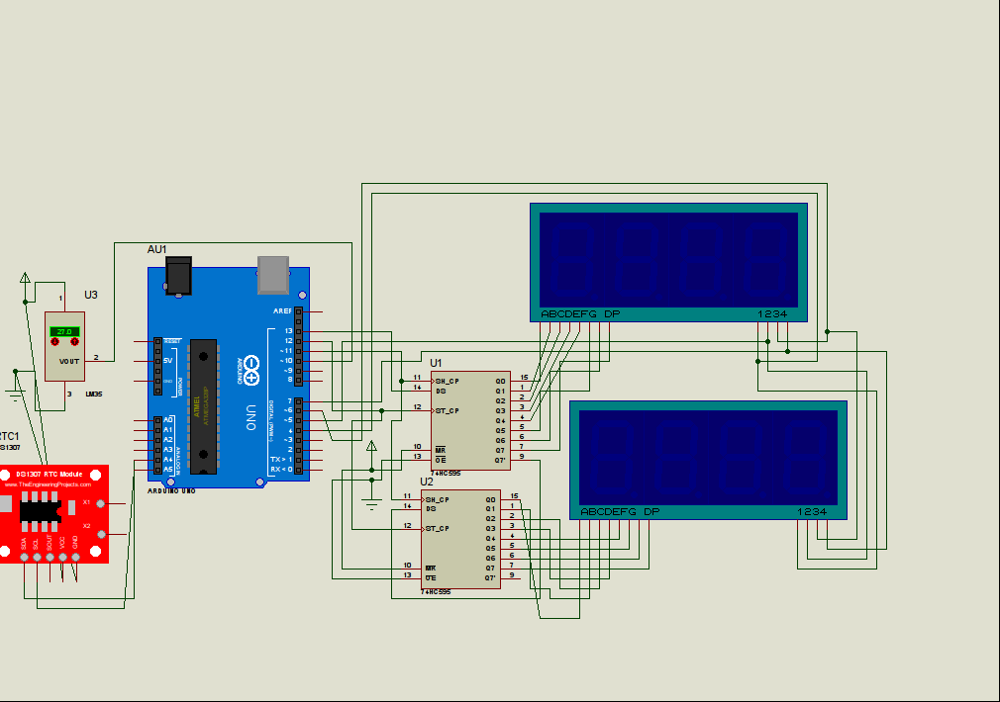

# prayer-time-management
*1st prize winner of **Mrs Sultana Begum Best Innovative Project Award, 2018***

|  |  |
|:--:|:--:|
| *pin diagram*  | *user interface* |

## Overview

In this project we have developed a smart prayer time management system for mosque. We have found out that, five times(Fajr, Johr, Asr, Magrib, EWe have injected  prayer times(fajr, johr, asr, magrib, esha) as well as sunrise and sunset into the microcontroller ROM for 1 year. Every day, the clock takes automatic update showing the updated prayer time.sha) prayer system need to be updated regularly as well as Jammat time is maintained. In order to maintain this, they need to operate the clock manually everyday. 
We have proposed a system, where an attendant do not need to update the prayer time (Owakt time) manually regularly. Again we have developed a web interface through which an attendant can update the Jammat time of that particular mosque from any part of the world.

## Features of Smart System:

- We have injected  prayer times(fajr, johr, asr, magrib, esha) as well as sunrise and sunset into the microcontroller ROM for 1 year. Every day, the clock takes automatic update showing the updated prayer time.
- An attendant can update Jammat time for a particular mosque from any network without being present at the mosque physically.
- An temperature sensor is introduced to show the room temperature.

## Required Instruments:

- NodeMCU (We have chosen this micro-controller because it contains an integrated Wi-Fi module . So, we don’t need any external module and it also reduces  instrumental cost)
- Couple of 4 digit 7 segment display
- Shift registers (74HC595)
- RTC ds 1307 (Real time clock chip)
- LM 35 temperature sensor.

## Working Principle:

We need seven 4 digit 7 segment display (five for prayer time and 2 for sunrise and sunset time). These times are static. Therefore, we have kept those times at NodeMCU ROM. At a particular day, the clock get updated by reading those static time from  ROM. 

Next, we need to handle the jammat time. This time vary from mosque to mosque. So, an attendant can update Jammat time of five times prayer time by our web interface. The clocks dedicated for Jammat time  are get updated now. We have used a RTC for displaying current time and introduced  LM 35 for displaying current temperature. Both the components are interfaced with NodeMCU. All displays are interfaced with microcontroller.  We have used shift registers for multiplexing purpose of the displays.

The source sketch can be found [here](nodemcu.ino). You can watch a demo [here](https://www.youtube.com/watch?v=Wvu3Wlt1V9g).
